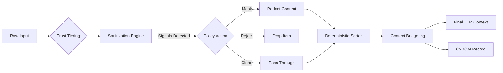

# Context Firewall Reference Implementation


A reference implementation demonstrating **Context Engineering as a Security Firewall**. 

This application serves as a proof-of-concept for securing Large Language Model (LLM) agents by enforcing strict governance over the context window *before* data reaches the model. It mitigates critical risks like Indirect Prompt Injection (IPI), Tool Coercion, and Context Contamination through deterministic compilation and trust tiering.

---

## 🛡️ Core Concepts

The Context Firewall operates on the principle that **not all context data is equal**. It segregates input sources into distinct trust tiers and applies rigorous sanitization gates based on a declarative policy.

### 1. Trust Tiers
*   **Trusted (Green):** Verified system prompts and developer-signed policies. Immutable by user input.
*   **Constrained (Amber):** User inputs that are necessary but must be sanitized for PII and basic injection attempts.
*   **Untrusted (Red):** External data (web pages, retrieved documents, emails) that are treated as hostile. These undergo aggressive sanitization and are quarantined in specific context blocks.

### 2. Deterministic Compilation
Unlike standard RAG pipelines that simply concatenate strings, the Context Firewall uses a **deterministic assembly engine**. It ensures that higher-trust items always precede lower-trust items (Policy Precedence) and that the exact state of the context window is reproducible for any given input.

### 3. Context Bill of Materials (CxBOM)
Every compilation run generates a **CxBOM**—a cryptographically verifiable record of exactly what entered the model's context. This includes:
*   SHA-256 hashes of all inputs.
*   Sanitization verdicts (Clean, Masked, Rejected).
*   Policy version and signatures.

---

## 🚀 Features

### Interactive Compiler & Firewall
The core playground of the application allowing you to:
*   **Simulate Context Assembly:** Add User Messages, System Policies, and Web Content.
*   **Test Attacks:** One-click injection of "Jailbreak" and "Tool Coercion" payloads to test the firewall.
*   **Visual Diff:** Inspect exactly how the firewall modified or rejected unsafe content via the **Intervention Detail View**.

### Policy Language (CxFW-PL) Visualization
View the declarative policy logic that drives the firewall.
*   **YAML Definition:** See the `cxwf_pl` structure for defining budgets, rules, and tool registries.
*   **Threat Matrix:** A detailed mapping of common LLM threats (e.g., IPI, Argument Smuggling) to specific firewall invariants.

### Operational Dashboard
A high-level view of security metrics, including:
*   Attack Success Rate (ASR) vs. Utility metrics.
*   Live threat feed showing blocked signals.
*   Sanitization rates across trust tiers.

---

## 🏗️ Architecture

The pipeline follows a strict linear flow:



## 🛠️ Getting Started

### Prerequisites
*   Node.js (v18+)
*   npm or yarn

### Installation

1.  Clone the repository:
    ```bash
    git clone https://github.com/your-org/context-firewall.git
    cd context-firewall
    ```

2.  Install dependencies:
    ```bash
    npm install
    ```

3.  Start the development server:
    ```bash
    npm start
    ```

4.  Open [http://localhost:3000](http://localhost:3000) to view the application.

---

## 🧪 Testing the Firewall

1.  Navigate to the **Compiler & Firewall** tab.
2.  Click **Add Injection** (Yellow Button).
    *   *Observation:* The system detects "Tool Coercion" signals. The item is **Masked**, replacing the dangerous instructions with a redaction notice.
3.  Click **Add Jailbreak** (Red Button).
    *   *Observation:* The system detects "Instruction Override" signals. The item is **Rejected** entirely and does not enter the compiled stream.
4.  Click on any item in the **Firewall Interventions** panel to see a side-by-side diff of the original malicious payload vs. the sanitized output.
5.  Click **CxBOM** to view the audit log for the run.

---

## 📜 Security Invariants

This implementation adheres to the following security invariants defined in the Context Firewall Specification:

*   **I1 (Provenance):** All data entering the context must have a verified source and trust tier.
*   **I2 (Precedence):** Trusted instructions always override Untrusted instructions via structural ordering.
*   **I6 (Auditability):** No context is sent to the model without a corresponding CxBOM entry.
*   **I7 (Determinism):** The same inputs and policy must always yield the exact same context window hash.

---

## 📦 Tech Stack

*   **Frontend:** React 19, TypeScript
*   **Styling:** Tailwind CSS
*   **Visualization:** Recharts, Lucide React
*   **Bundling:** Vite (implied) / ESM

---

## 📄 License

This project is licensed under the Apache 2.0 License - see the LICENSE file for details.
